# 如何连接实验室的杭电服务器
## 1、密匙文件
### 1）向管理员索要密匙文件
- 管理员会以人名在服务器（的linux系统）上创建一个用户
- 在本例中该linux用户的用户名为“caixuanhao”
- 管理员所给密匙文件（Identify file）一般也以用户名作为文件名
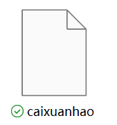
### 2）放在本地任何地方都可以
- **密匙文件的内容如下(用vscode等打开)**
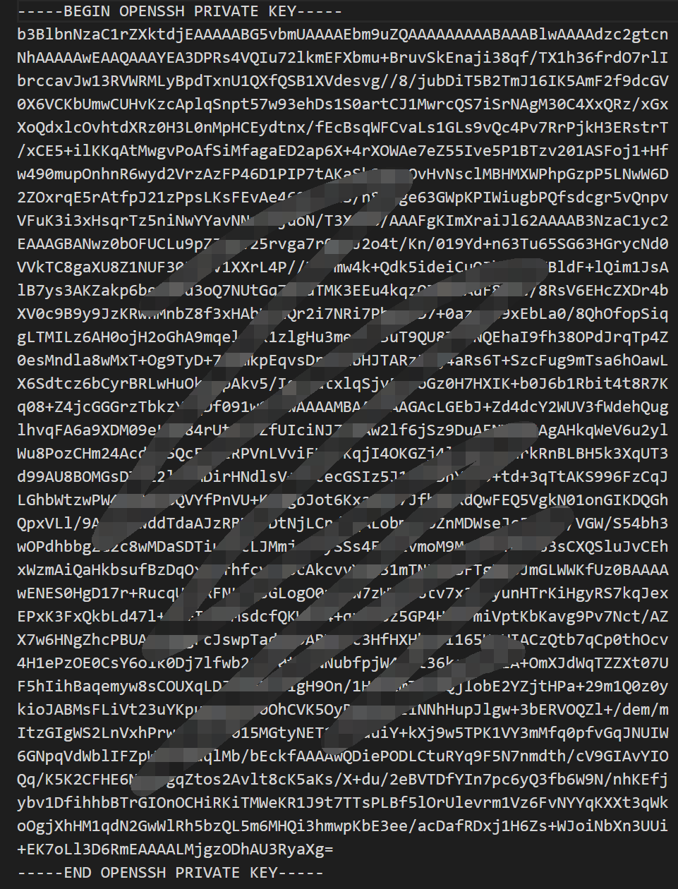
## 2、vscode配置&连接服务器
### 1）插件安装
- **安装ssh插件** 
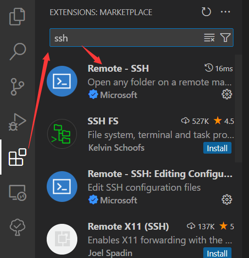
### 2）连接配置
- **点击左下角图标**
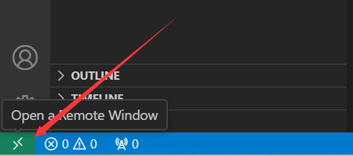
- **选择"Connect to Host"**
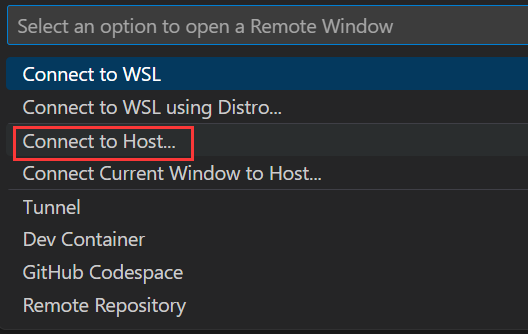
- **选择“Configure SSH Hosts”**
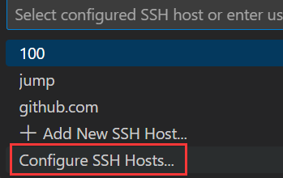
- **选择ssh服务的config文件路径，一般为"C:\Users\\${userName}\\.ssh\config"**
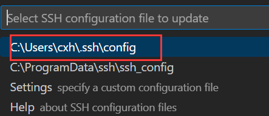
- **在config文件中输入如图示内容配置要连接的服务器的信息**
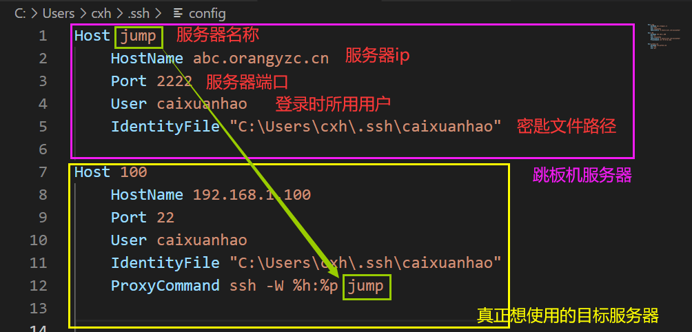
  - 服务器名称：随便取，仅在连接时作为提示信息
  - 服务器ip：
    - 跳板机和目标使用服务器的各自有各自的ip（跳板机可当成媒介作用的服务器，用于“跳”到目标服务器上）
    - 跳板机的ip地址经常更换，详见服务器群内通知
  - 服务器端口：和ip配套
  - 登陆时所用用户：一般和管理员提供的密匙文件名相同
  - 密匙文件路径：密匙文件放哪里都可以，关键是所在的路径要填对
### 3）连接服务器
- 直接连接目标服务器
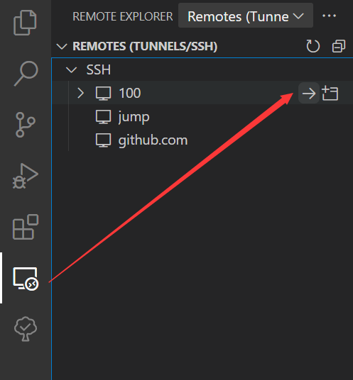
**-------------------------------或者-------------------------------**
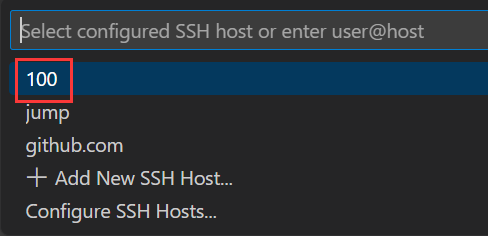
- 选择continue后，选择linux
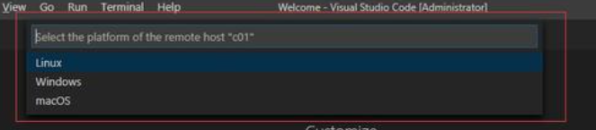
- 服务器窗口左下角图标显示“SSH：（目标服务器名称）”代表连接成功
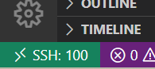
## 3、开始Coding
### 1）打开文件夹
- **管理员只给了每个用户为其创建的文件夹的权限**
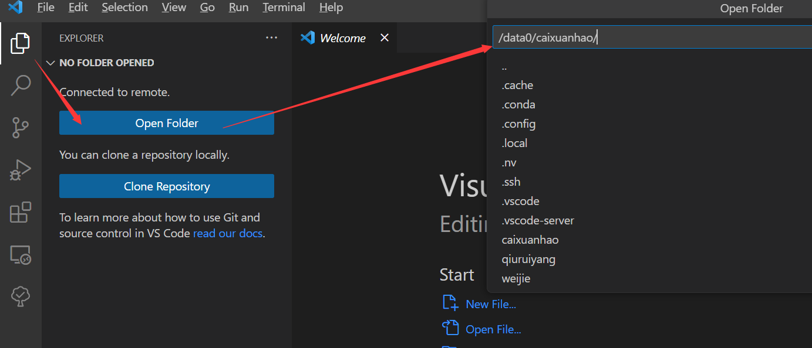
- **之后可以直接选择此文件夹**
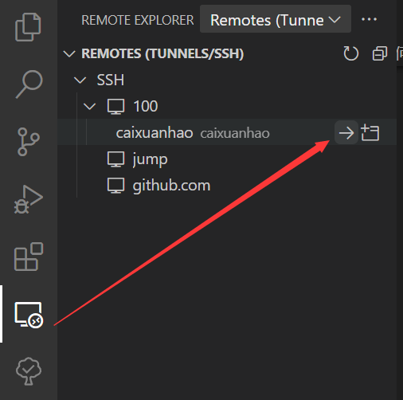
### 2）开始Coding
- **文件传输可直接拖拽入/出，大文件建议使用wget在服务器上下载**
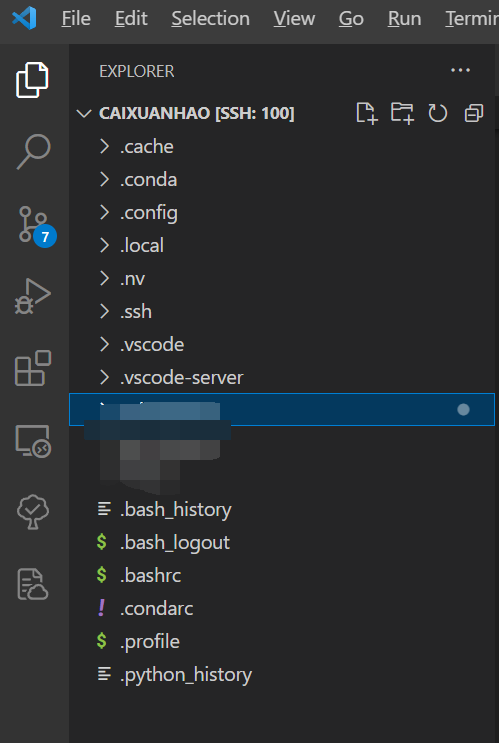
- **使用wget前需要开启服务器代理进行翻墙，命令为proxyon；注意只打开当前终端的代理，新终端默认不自动开启代理**
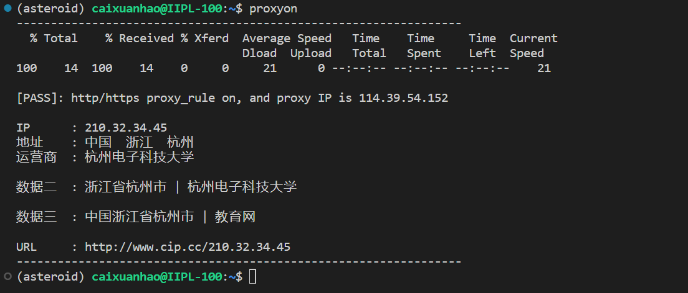
- **终端快捷键ctrl+·**
- **nvidia-smi:查看各显卡占用（2、3空闲）**
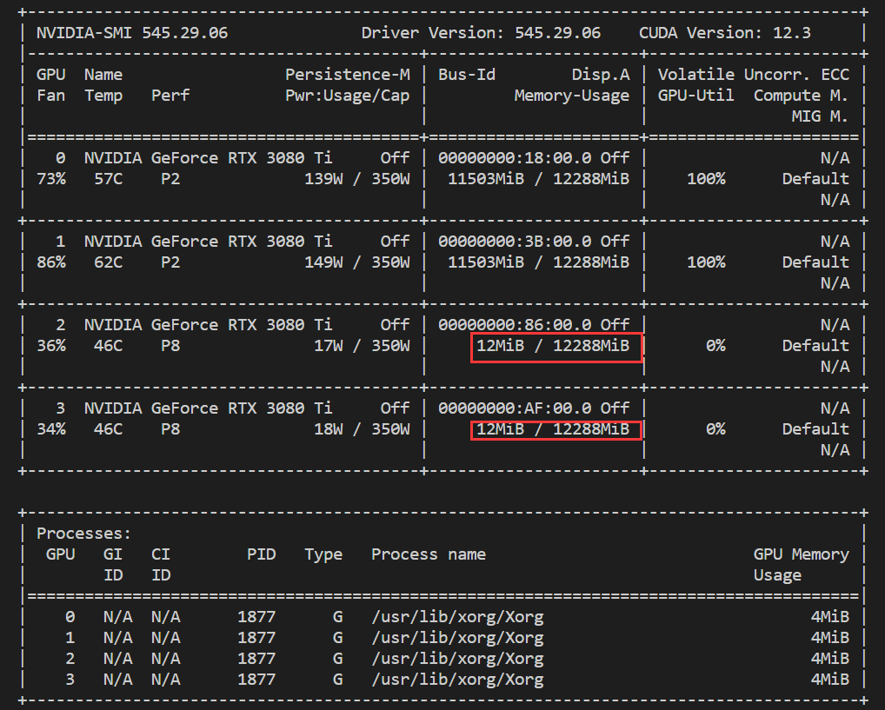
- **export CUDA_VISIBLE_DEVICES=2,3:设置2、3显卡为可见显卡（即设置用GPU跑的代码使用哪些GPU）**